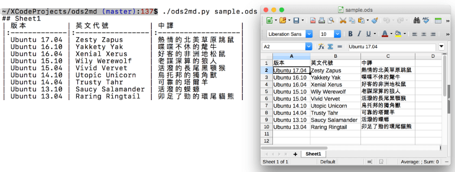

ods2md
======

[](https://opensource.org/licenses/MIT)
[](https://travis-ci.org/kennytm/ods2md)

Convert LibreOffice Calc Spreadsheets (*.ods) into Markdown tables



Install
-------

1. Get Python 3.

2. (Optional) Create a virtual environment.

    ```sh
    python3 -m venv env
    . env/bin/activate
    ```

3. Install `ezodf` for parsing *.ods files

    ```sh
    pip3 install -r requirements.txt
    ```

Usage
-----

```sh
./ods2md.py input_file.ods > output_file.md
```

Limitations
-----------

* This program disregards all formats. Currencies and percentages will be displayed as plain numbers.
* Merged cells are not supported, the content will be shown at the first cell (this is actually a limitation of GFM table)
